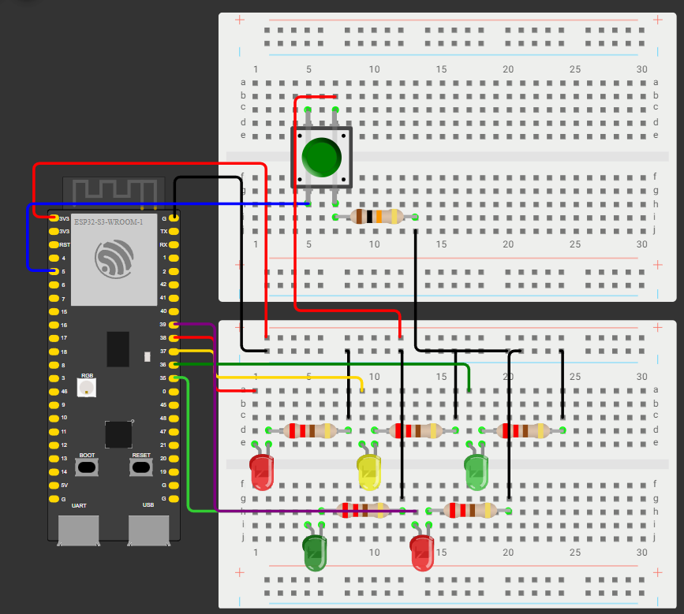

# Sistema inteligente para controle de semáforos
Sistema embarcado para controle inteligente de semáforos utilizando ESP32-S3, desenvolvido com máquina de estados finitos, interrupções externas, temporização não bloqueante com "millis()", modularização do código e boas práticas.
## Sobre o Projeto
O projeto é a elaboração de um sistema que integra um semáforo de carros e um semáforo de pedestres com um botão em que, quando pressionado, gera uma interrupção no sistema e inicia uma rotina para que as luzes dos dois semáforos fiquem adequadas para a passagem do pedestre com segurança. O objetivo do projeto foi de utilizar boas práticas de código no desenvolvimento de sistemas embarcados, entre elas: modularização, controle baseado em máquina de estados, interrupção, temporização não bloquenate do processador com a função millis() e código legível e organizado.
## Funcionalidades: 
- Máquina de estados finitos
- Temporização não bloqueante do processador com a função "millis()"
- Interrupção externa
- Botão de pedestres
- Código modularizado
## Tecnologias utilizadas:
- C/C++ embarcado
- ESP32-S3
- Arduino Framework
- Wokwi para simulação
- Git/Github
## Estrutura do projeto:
```txt
smart-traffic-system-esp32/
│
├── src/
│   ├── botao_pedestre.cpp
│   ├── main.cpp
│   ├── maquina_estados.cpp
│   ├── semaforo.cpp
│   └── semaforo_pedestre.cpp
│
├── include/
│   ├── botao_pedestre.h
│   ├── maquina_estados.h
│   ├── semaforo.h
│   └── semaforo_pedestre.h
│
├── simulations/
│   ├── diagram.json
│   └── wokwi-project.txt
│
├── assets/
│   ├── circuito.png
│   ├── demo.mp4
│   └── funcionamento.gif
│
├── README.md
└── LICENSE
```
## Circuito:

## Demonstração:

## Simulação no Wokwi:
https://wokwi.com/projects/463500641205755905
## Como Executar:
1. Abra o projeto no Wokwi
2. Execute a simulação
3. Pressione o botão de pedestre
## Aprendizados:
- Modularização de código
- Máquinas de estados
- Controle não bloqueante
- Interrupções externas
- Organização de projetos embarcados
## Melhoria futura:
- Elaboração de uma placa de circuito impressa (PCB)
## Autor
Lucas Fontana Soliman

GitHub:
https://github.com/lucasfsoliman
